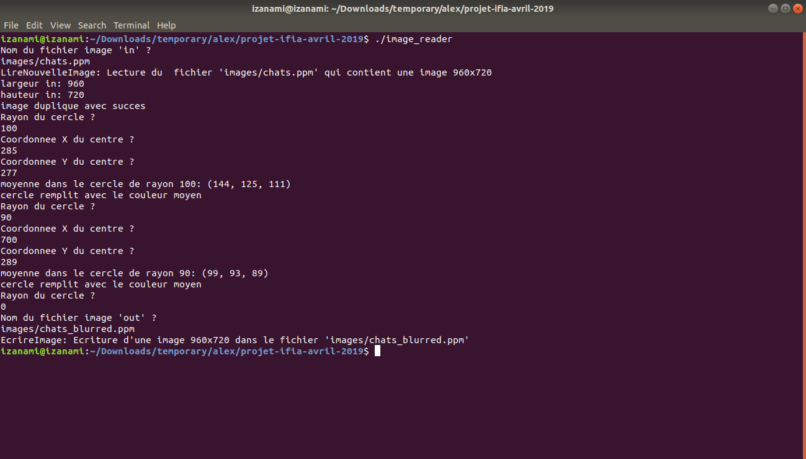

# Image Anonymat

A mini project in C to blur parts of the image.

### Compilation instructions

Execute the makefile in the base directory

    make

### Execution instructions

    ./image_reader

Give positive radii to blur in the image, along with the x and y coordinates

When finished, give a negative radius to stop

Example execution

